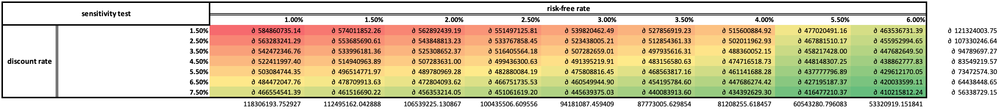

# 2022 SOA Challenge: Construction of a Competitive national football team for Rarita

**The University of New South Wales**

**Team Cool**

**Team Member: YIXUAN WANG, WENYAN REN, BIHAN SHEN, YIFAN XIAO, YIFAN LI**

---

## Overview

This page is used to showcase our project briefly. This showcase page will include brief discussion on the main objective of the project, assumptions, team selection, expense and revenue analysis, implementation, economic impact, risks and risk mitigation, and data and data limitation.

> To access the full report, please click [Full Report](Team Cool_Report of Construction of the Competitive national football team for Rarita.docx).
> To find more details on 2022 SOA Challenge, please click [2022 SOA Challenge] (https://www.soa.org/research/opportunities/2022-student-research-case-study-challenge/).

---

## Objectives

Football has been a heavily watched sport worldwide and the success of the national soccer team can bring positive effects on a country’s economy. The international Football and Sporting Association (FSA) gets increasingly more attention in the world the winning countries’ global visibility enhances; it attracts many new investments, develops the national tourism and political influence hence accelerating the economic growth. Therefore we plan to construct a “competitive” national soccer team for Rarita which aims to become top 10 members of the FSA in the next five years with relatively high probability of being an FSA champion. In addition, some potential impacts of the construction of such a national team on Rarita’s economy over next 10 years are also discussed.

## Assumptions

* Metrics in players’ data is regarded as standardized values with a “special” method. We regarded some “negative” metrics as indicators of  “extremely” bad performance;
* Assume that players employed by other countries which attend tournament are all  local players hence their football-soccer expense does not include foreign players’ salaries.
* Purchasing Power Parity theory. Assume that Rarita’s currencies should have the same purchasing power with other currencies after adjusting for exchange rate- i.e. prices of the same goods/services should be equal when they are expressed in Doubloons.
* Assume that the outflow of expenses and the inflow of revenues are at end of each year;
* Discount rate – 4.45% 

The average rate for nominal spot rates of risk-free bonds mature in 2032 which is higher than that of earlier maturity hence being more conservative.

* Annual percentage rate for 6-year loan - 2.8%

The average of nominal risk-free rate for the maturity of 6 years during the year 2010-2020

## Team Selection

### <u>Structure</u>

Rarita needs 25 footballers to build a formative national team, including 11 starters and 14 substitutes.

### <u>Data Preparation</u>

**1.Missing value**

To build the model to help us select team we mainly use the tournament information (which has the results) provided. We found that defensing and passing data only include the information of 2021 tournament. Although there are some 2020 data of shooting performance however there exists high proportion of missing for some metrics (e.g. Standard Dist has 100% of missing) therefore we only use data for 2021 tournament to build model in this project.

> Missing data for shooting and goalkeeping:
>
> 

> 
> 

>
> 

> 
> 

**2.variable selection**

We first checked the correlations and analyzed the meaning of metrics to reduce the dimensions. Through analysis of correlations and meanings we remove some metrics which have similar representatives with another metric(s).

> Correlation matrix plots:
>
> 

> 
> 

>
> 

> 
> 

### <u>Entropy weighted method</u>

First we standardized both league and tournament data. Then we separate 4 original metrics into 7 independent metrics based on positions:

* Forward: shooting
* Forward: passing
* Midfielder: defense
* Midfielder: passing
* Defender: defender
* Defender: passing
* Goalkeeper: goalkeeping

Furthermore, there are numerous minor measurement features in each main metric which could significantly increase the model complexity. Also, our team are lack of experiences in soccer which the subjective weighted methods are not suitable in this case. Thus, we applied Entropy Weight Method (EWM) to determines the objective index weight for each minor measurements according to the dispersion degree and calculate an overall score for each major metric. Moreover, since the success of soccer team is based on the performance of every player, therefore, we take the average score for each team by position for further analysis instead of solely considering the personal performance. 

After the data manipulation procedures, the dimension of measurement for each nation are reduced to 7 variables that explain the tournament rank:

| **Nation**              | **ShootingFW** | **PassingMF** | **PassingFW** | **PassingDF** | **DefenseDF** | **DefenseMF** | **GoalkeepingGK** | **rank21** |
| ----------------------- | -------------- | ------------- | ------------- | ------------- | ------------- | ------------- | ----------------- | ---------- |
| Bernepamar              | 0.0457         | 0.0223        | 0.0301        | 0.0263        | 0.0277        | 0.0263        | 0.0298            | 8          |
| Byasier Pujan           | 0.0235         | 0.0331        | 0.0425        | 0.0281        | 0.0268        | 0.0234        | 0.0349            | 15         |
| Djipines                | 0.0221         | 0.0174        | 0.0262        | 0.0160        | 0.0284        | 0.0313        | 0.0293            | 16         |
| Eastern Niasland        | 0.0163         | 0.0150        | 0.0178        | 0.0097        | 0.0348        | 0.0405        | 0.0308            | 23         |
| Eastern Sleboube        | 0.0242         | 0.0179        | 0.0294        | 0.0143        | 0.0257        | 0.0382        | 0.0236            | 19         |
| Esia                    | 0.0278         | 0.0362        | 0.0322        | 0.0409        | 0.0228        | 0.0224        | 0.0213            | 14         |
| Galamily                | 0.0244         | 0.0188        | 0.0214        | 0.0269        | 0.0240        | 0.0190        | 0.0286            | 7          |
| Giumle Lizeibon         | 0.0321         | 0.0483        | 0.0398        | 0.0257        | 0.0333        | 0.0306        | 0.0255            | 10         |
| Greri Landmoslands      | 0.0414         | 0.0439        | 0.0468        | 0.0389        | 0.0284        | 0.0214        | 0.0282            | 11         |
| Ledian                  | 0.0098         | 0.0203        | 0.0212        | 0.0342        | 0.0269        | 0.0224        | 0.0294            | 18         |
| Leoneku Guidisia        | 0.0160         | 0.0193        | 0.0098        | 0.0081        | 0.0337        | 0.0377        | 0.0346            | 17         |
| Manlisgamncent          | 0.0341         | 0.0285        | 0.0297        | 0.0194        | 0.0241        | 0.0194        | 0.0202            | 13         |
| Mico                    | 0.0345         | 0.0351        | 0.0370        | 0.0312        | 0.0222        | 0.0263        | 0.0304            | 4          |
| New Uwi                 | 0.0209         | 0.0074        | 0.0187        | 0.0099        | 0.0353        | 0.0261        | 0.0251            | 20         |
| Nganion                 | 0.0399         | 0.0559        | 0.0465        | 0.0507        | 0.0188        | 0.0296        | 0.0288            | 3          |
| Ngoque Blicri           | 0.0218         | 0.0283        | 0.0149        | 0.0195        | 0.0304        | 0.0256        | 0.0271            | 21         |
| Nkasland Cronestan      | 0.0203         | 0.0198        | 0.0378        | 0.0363        | 0.0319        | 0.0236        | 0.0141            | 22         |
| People's Land of Maneau | 0.0248         | 0.0277        | 0.0270        | 0.0427        | 0.0248        | 0.0277        | 0.0370            | 2          |
| Quewenia                | 0.0290         | 0.0162        | 0.0227        | 0.0275        | 0.0296        | 0.0338        | 0.0276            | 5          |
| Sobianitedrucy          | 0.0371         | 0.0306        | 0.0294        | 0.0400        | 0.0232        | 0.0233        | 0.0286            | 1          |
| Southern Ristan         | 0.0452         | 0.0219        | 0.0172        | 0.0283        | 0.0308        | 0.0103        | 0.0372            | 6          |
| Varijitri Isles         | 0.0170         | 0.0327        | 0.0455        | 0.0278        | 0.0317        | 0.0282        | 0.0235            | 24         |
| Xikong                  | 0.0237         | 0.0077        | 0.0164        | 0.0074        | 0.0160        | 0.0249        | 0.0299            | 12         |

> Example of entropy weighted method applied to forward shooting:
> Standardized data:
>
> | **Nation**              | **90s** | **Gls** | **Standard SoT%** | **Standard Sh/90** | **Standard SoT/90** | **Standard G/Sh** | **Standard Dist** | **Performance PK** | **Performance PKatt** | **Standard FK** | **Expected xG** | **Expected npxG/Sh** | **Expected np:G-xG** |
> | ----------------------- | ------- | ------- | ----------------- | ------------------ | ------------------- | ----------------- | ----------------- | ------------------ | --------------------- | --------------- | --------------- | -------------------- | -------------------- |
> | Bernepamar              | 0.3863  | 1.0000  | 0.7421            | 0.5864             | 0.5633              | 0.8514            | 0.2488            | 0.1542             | 0.2121                | 0.3663          | 1.0000          | 1.0000               | 0.8408               |
> | Byasier Pujan           | 0.1853  | 0.2510  | 0.2649            | 0.3343             | 0.1456              | 0.2950            | 0.4183            | 0.7761             | 0.6263                | 0.1123          | 0.2422          | 0.0168               | 0.6025               |
> | Djipines                | 0.4961  | 0.1522  | 0.5864            | 0.1739             | 0.1912              | 0.4894            | 0.0000            | 0.1578             | 0.2641                | 0.0405          | 0.3026          | 0.5754               | 0.4698               |
> | Dosqaly                 | 0.3312  | 0.2672  | 0.8437            | 0.6017             | 0.4792              | 0.3017            | 0.5222            | 0.4900             | 0.5000                | 0.3136          | 0.5075          | 0.0279               | 0.2744               |
> | Eastern Niasland        | 0.0523  | 0.0830  | 0.4115            | 0.2293             | 0.1025              | 0.5112            | 0.2782            | 0.3560             | 0.1380                | 0.2305          | 0.0000          | 0.1816               | 0.5406               |
> | Eastern Sleboube        | 0.3478  | 0.2272  | 0.7699            | 0.0219             | 0.1339              | 0.4291            | 0.4792            | 0.6340             | 0.3333                | 0.3002          | 0.1983          | 0.1732               | 0.5512               |
> | Esia                    | 0.2773  | 0.2438  | 0.5837            | 0.2682             | 0.2694              | 0.5642            | 0.3439            | 0.2600             | 0.1515                | 0.4079          | 0.3912          | 0.7263               | 0.3642               |
> | Galamily                | 0.3601  | 0.2516  | 0.5741            | 0.4972             | 0.3034              | 0.2825            | 0.2953            | 0.2537             | 0.4394                | 0.2361          | 0.4231          | 0.1955               | 0.2713               |
> | Giumle Lizeibon         | 0.1541  | 0.4538  | 1.0000            | 0.7230             | 1.0000              | 0.6225            | 0.1610            | 0.2897             | 0.1919                | 0.0803          | 0.4459          | 0.2913               | 0.5928               |
> | Greri Landmoslands      | 0.3590  | 0.3115  | 0.6787            | 0.8630             | 0.5677              | 0.3855            | 0.1950            | 0.8922             | 0.9798                | 0.3857          | 0.8655          | 0.5447               | 0.0000               |
> | Ledian                  | 0.0429  | 0.0172  | 0.0000            | 0.1351             | 0.0000              | 0.0000            | 0.4623            | 0.3470             | 0.0000                | 0.2167          | 0.1358          | 0.0000               | 0.4694               |
> | Leoneku Guidisia        | 0.0000  | 0.1385  | 0.2594            | 0.1519             | 0.0980              | 0.2793            | 0.5604            | 0.0464             | 0.3131                | 0.1123          | 0.1388          | 0.3445               | 0.4746               |
> | Manlisgamncent          | 0.2505  | 0.6858  | 0.6075            | 0.3947             | 0.3552              | 0.8883            | 0.2291            | 0.3505             | 0.2054                | 0.1517          | 0.6243          | 0.5028               | 1.0000               |
> | Mico                    | 0.5732  | 0.4875  | 0.6820            | 0.6816             | 0.4810              | 0.5794            | 0.3861            | 0.1915             | 0.3182                | 0.3303          | 0.4049          | 0.3152               | 0.8222               |
> | New Uwi                 | 0.0477  | 0.1469  | 0.9634            | 0.1000             | 0.2650              | 0.4190            | 1.0000            | 0.0000             | 0.2606                | 0.2793          | 0.0665          | 0.0838               | 0.7238               |
> | Nganion                 | 0.8654  | 0.4504  | 0.8195            | 0.8757             | 0.6673              | 0.5978            | 0.2103            | 0.1720             | 0.4459                | 0.3382          | 0.8733          | 0.4190               | 0.2894               |
> | Ngoque Blicri           | 0.1650  | 0.0000  | 0.6439            | 0.8185             | 0.6014              | 0.1676            | 0.0966            | 0.3781             | 0.0455                | 0.1862          | 0.4687          | 0.2328               | 0.1135               |
> | Nkasland Cronestan      | 0.2039  | 0.2254  | 0.4217            | 0.4682             | 0.2450              | 0.3285            | 0.3277            | 0.3497             | 0.1775                | 0.2400          | 0.3365          | 0.0391               | 0.4203               |
> | People's Land of Maneau | 0.8032  | 0.1797  | 0.7592            | 0.0000             | 0.1645              | 0.6034            | 0.1754            | 0.1791             | 0.3030                | 0.1807          | 0.2703          | 0.3631               | 0.6149               |
> | Quewenia                | 0.5471  | 0.3433  | 0.9597            | 0.3958             | 0.4262              | 1.0000            | 0.2714            | 0.1791             | 0.1688                | 0.1324          | 0.2635          | 0.2235               | 0.7068               |
> | Sobianitedrucy          | 1.0000  | 0.2826  | 0.4485            | 1.0000             | 0.3894              | 0.3448            | 0.5116            | 0.2075             | 0.3506                | 1.0000          | 0.5319          | 0.0758               | 0.2930               |
> | Southern Ristan         | 0.5945  | 0.5344  | 0.8245            | 0.1615             | 0.2641              | 0.9721            | 0.3126            | 1.0000             | 1.0000                | 0.4079          | 0.4641          | 0.6983               | 0.7510               |
> | Varijitri Isles         | 0.4658  | 0.0906  | 0.0997            | 0.4369             | 0.0709              | 0.0838            | 0.5446            | 0.3532             | 0.2424                | 0.1419          | 0.2452          | 0.0838               | 0.0206               |
> | Xikong                  | 0.3555  | 0.3144  | 0.7738            | 0.3046             | 0.2593              | 0.3754            | 0.0526            | 0.3184             | 0.2606                | 0.0000          | 0.4787          | 0.4190               | 0.4019               |
>
> Index’s Entropy:
>
> | **90s**   | **Gls**   | **Standard SoT%** | **Standard Sh/90** | **Standard SoT/90** | **Standard G/Sh** | **Standard Dist** | **Performance PK** | **Performance PKatt** | **Standard FK** | **Expected xG** | **Expected npxG/Sh** | **Expected np:G-xG** |
> | --------- | --------- | ----------------- | ------------------ | ------------------- | ----------------- | ----------------- | ------------------ | --------------------- | --------------- | --------------- | -------------------- | -------------------- |
> | 0.9182395 | 0.9191152 | 0.9626163         | 0.9225522          | 0.9278407           | 0.948894          | 0.9400071         | 0.9257322          | 0.9244672             | 0.9248543       | 0.9387893       | 0.8934433            | 0.947453             |
>
> Entropy weight:
>
> | **90s**     | **Gls**     | **Standard SoT%** | **Standard Sh/90** | **Standard SoT/90** | **Standard G/Sh** | **Standard Dist** | **Performance PK** | **Performance PKatt** | **Standard FK** | **Expected xG** | **Expected npxG/Sh** | **Expected np:G-xG** |
> | ----------- | ----------- | ----------------- | ------------------ | ------------------- | ----------------- | ----------------- | ------------------ | --------------------- | --------------- | --------------- | -------------------- | -------------------- |
> | 0.006767268 | 0.006695274 | 0.003105634       | 0.006412595        | 0.005977329         | 0.004240773       | 0.004974539       | 0.006150912        | 0.00625503            | 0.006223172     | 0.005075008     | 0.008801567          | 0.004359822          |

### <u>Modelling and team selection</u>

Rather than directly choosing players from league data based on scores, we did regression analysis in advance to discover the relative significance of scores for each position on the overall rank. We replace the rank by 1 and 0 with 1 indicates successfully achieving top 10 in FSA and implement logistic regression to derive success rate. The relative significance of variables is based on AIC stepwise selection. In addition, we checked the feature importance by random forest method which also provide a similar result on variable significance. The variables chosen for modelling are ShootingFW, PassingFW, PassingDF, DefenseMF, and GoalkeepingGK.

The selection of Rarita team is generally based on scores of ShootingFW, PassingDF, DefenseMF, and GoalkeepingGK for corresponding positions. We choose the players with top 5% scores in league from Rarita and then hire top players from other nations if there are insufficient players in the team. 

> Players selected:

| Player         | Nation                  | Pos  |
| -------------- | ----------------------- | ---- |
| K. Adong       | Dosqaly                 | FWMF |
| F. Akongo      | Nganion                 | MFFW |
| A. Perez       | Rarita                  | FW   |
| V. Zhao        | Rarita                  | MF   |
| H. Jew         | Landsfupua              | GK   |
| L. De Wit      | Greri Landmoslands      | FW   |
| L. Ndyanabo    | Imaar Vircoand          | FWMF |
| D. Tukamuhebwa | People's Land of Maneau | FW   |
| H. Makumbi     | Rarita                  | FW   |
| F. Acayo       | Rarita                  | DF   |
| H. Azizi       | Rarita                  | DF   |
| K. Musah       | Rarita                  | DF   |
| P. Murmu       | Rarita                  | DF   |
| R. Mensah      | Rarita                  | DF   |
| W. Mbaziira    | Rarita                  | DF   |
| X. Takagi      | Rarita                  | DF   |
| Z. Kakai       | Rarita                  | MFDF |
| N. Bondarenko  | People's Land of Maneau | FWMF |
| U. Angella     | People's Land of Maneau | MF   |
| M. Ludwig      | Rarita                  | DFMF |
| O. Tshuma      | Rarita                  | DFMF |
| V. Sultan      | Rarita                  | DFMF |
| B. Ayuba       | Rarita                  | MF   |
| F. Akumu       | Rarita                  | GK   |
| W. Nasiru      | Rarita                  | GK   |

## Expense and Revenue

### <u>Expense</u>

a. Calculated the average expenses (total, staff cost and commercial) of top 10 countries in tournament as the expected total football expense for a country which assembles a competitive national team.(in 2020 total expense: ∂279.92, staff cost: ∂189.07,other expense:∂90.85)

b. Subtracting corresponding Rarita’s original expense (without national team) as the direct expenses of the team.( ∂131.23 in 2020)

c. Adjusting with adjusting factors (1.1 for first 3 years and 1 afterwards)

d. Adding expenses on foreign players to get the total (per Capita) team expense

e. From 2021, each term used in calculation should be derived by multiplying the corresponding term of the last year inflation factor. 

| Year | Per Capita     Total Expense (∂) | Per Capita     Staff     Costs (∂) | Per Capita     Other     Expenses (∂) | Expense(without team) (∂) | Team Expense (∂) | Adjusted Team Expense (∂) | Expense for foreign players (∂) | Total Team Expense (∂) |
| ---- | -------------------------------- | ---------------------------------- | ------------------------------------- | ------------------------- | ---------------- | ------------------------- | ------------------------------- | ---------------------- |
| 2020 | 279.92                           | 189.07                             | 90.85                                 | 148.69                    | 131.23           | 131.23                    | -                               | -                      |
| 2021 | 285.54                           | 192.86                             | 92.68                                 | 151.67                    | 133.86           | 133.86                    | -                               | -                      |
| 2022 | 293.92                           | 198.52                             | 95.40                                 | 156.12                    | 137.79           | 151.57                    | 15.08                           | 166.65                 |
| 2023 | 301.53                           | 203.66                             | 97.87                                 | 160.17                    | 141.36           | 155.50                    | 15.40                           | 170.90                 |
| 2024 | 309.11                           | 208.78                             | 100.33                                | 164.20                    | 144.92           | 159.41                    | 15.72                           | 175.13                 |
| 2025 | 318.54                           | 215.15                             | 103.39                                | 169.20                    | 149.34           | 149.34                    | 16.13                           | 165.47                 |
| 2026 | 331.93                           | 224.19                             | 107.73                                | 176.32                    | 155.61           | 155.61                    | 16.74                           | 172.35                 |
| 2027 | 335.73                           | 226.76                             | 108.97                                | 178.33                    | 157.39           | 157.39                    | 16.86                           | 174.25                 |
| 2028 | 343.09                           | 231.74                             | 111.36                                | 182.25                    | 160.85           | 160.85                    | 17.16                           | 178.01                 |
| 2029 | 347.59                           | 234.78                             | 112.82                                | 184.64                    | 162.96           | 162.96                    | 17.31                           | 180.27                 |
| 2030 | 360.75                           | 243.66                             | 117.09                                | 191.63                    | 169.13           | 169.13                    | 17.89                           | 187.02                 |
| 2031 | 368.32                           | 248.77                             | 119.55                                | 195.65                    | 172.67           | 172.67                    | 18.19                           | 190.87                 |
| 2032 | 379.60                           | 256.39                             | 123.21                                | 201.64                    | 177.96           | 177.96                    | 18.67                           | 196.63                 |

Predicted inflation rates, populations for Rarita, expenses for foreign players:

| Year | Annual Inflation rate |
| ---- | --------------------- |
| 2021 | 2.01%                 |
| 2022 | 2.93%                 |
| 2023 | 2.59%                 |
| 2024 | 2.52%                 |
| 2025 | 3.05%                 |
| 2026 | 4.20%                 |
| 2027 | 1.14%                 |
| 2028 | 2.19%                 |
| 2029 | 1.31%                 |
| 2030 | 3.79%                 |
| 2031 | 2.10%                 |
| 2032 | 3.06%                 |

| Year | Polulation |
| ---- | ---------- |
| 2021 | 13000173   |
| 2022 | 13056086   |
| 2023 | 13111999   |
| 2024 | 13167912   |
| 2025 | 13223825   |
| 2026 | 13279738   |
| 2027 | 13335651   |
| 2028 | 13391564   |
| 2029 | 13447477   |
| 2030 | 13503390   |
| 2031 | 13559303   |
| 2032 | 13615216   |

| Year | Foreign players' salaries | Rent of players | Total Expense for foreign players | per Capita Expense |
| ---- | ------------------------- | --------------- | --------------------------------- | ------------------ |
| 2021 | ∂ 173866000               | ∂ 17386600      | ∂ 191252600                       | ∂ 14.71            |
| 2022 | ∂ 178966523               | ∂ 17896652      | ∂ 196863176                       | ∂ 15.08            |
| 2023 | ∂ 183602022               | ∂ 18360202      | ∂ 201962225                       | ∂ 15.40            |
| 2024 | ∂ 188219941               | ∂ 18821994      | ∂ 207041935                       | ∂ 15.72            |
| 2025 | ∂ 193960782               | ∂ 19396078      | ∂ 213356860                       | ∂ 16.13            |
| 2026 | ∂ 202113454               | ∂ 20211345      | ∂ 222324800                       | ∂ 16.74            |
| 2027 | ∂ 204425260               | ∂ 20442526      | ∂ 224867786                       | ∂ 16.86            |
| 2028 | ∂ 208911768               | ∂ 20891177      | ∂ 229802945                       | ∂ 17.16            |
| 2029 | ∂ 211652159               | ∂ 21165216      | ∂ 232817375                       | ∂ 17.31            |
| 2030 | ∂ 219664430               | ∂ 21966443      | ∂ 241630873                       | ∂ 17.89            |
| 2031 | ∂ 224272166               | ∂ 22427217      | ∂ 246699382                       | ∂ 18.19            |
| 2032 | ∂ 231138719               | ∂ 23113872      | ∂ 254252591                       | ∂ 18.67            |

| Year | Foreign players' salaries (∂) | Rent of players (∂) | Total Expense for foreign players  (∂) | per Capita Expense (∂) |
| ---- | ----------------------------- | ------------------- | -------------------------------------- | ---------------------- |
| 2021 | 173866000.00                  | 17386600.00         | 191252600.00                           | 14.71                  |
| 2022 | 178966523.43                  | 17896652.34         | 196863175.78                           | 15.08                  |
| 2023 | 183602022.29                  | 18360202.23         | 201962224.52                           | 15.40                  |
| 2024 | 188219941.35                  | 18821994.14         | 207041935.49                           | 15.72                  |
| 2025 | 193960782.11                  | 19396078.21         | 213356860.32                           | 16.13                  |
| 2026 | 202113454.29                  | 20211345.43         | 222324799.72                           | 16.74                  |
| 2027 | 204425259.70                  | 20442525.97         | 224867785.67                           | 16.86                  |
| 2028 | 208911768.04                  | 20891176.80         | 229802944.85                           | 17.16                  |
| 2029 | 211652159.18                  | 21165215.92         | 232817375.10                           | 17.31                  |
| 2030 | 219664430.13                  | 21966443.01         | 241630873.14                           | 17.89                  |
| 2031 | 224272165.74                  | 22427216.57         | 246699382.31                           | 18.19                  |
| 2032 | 231138719.08                  | 23113871.91         | 254252590.99                           | 18.67                  |

### <u>Revenue</u>

Revenues are predicted with the similar process with expenses projection. The only difference is that there is no revenue from foreign players.

| Year | Per Capita     Total Revenue (∂) | Per Capita     Matchday (∂) | Per Capita     Broadcast (∂) | Per Capita     Commercial (∂) | Per Capita Revenue (without team)  (∂) | Per Capita Team Revenue (∂) | Adjusted factor | Adjusted Team Reveue (∂) | Per Capita Total Team Revenue (∂) |
| ---- | -------------------------------- | --------------------------- | ---------------------------- | ----------------------------- | -------------------------------------- | --------------------------- | --------------- | ------------------------ | --------------------------------- |
| 2022 | 333.36                           | 50.81                       | 130.98                       | 151.57                        | 171.29                                 | 162.07                      | 85%             | 137.76                   | 117.10                            |
| 2023 | 341.99                           | 52.12                       | 134.37                       | 155.49                        | 175.72                                 | 166.27                      | 90%             | 149.64                   | 134.68                            |
| 2024 | 350.59                           | 53.44                       | 137.75                       | 159.40                        | 180.14                                 | 170.45                      | 95%             | 161.93                   | 153.83                            |
| 2025 | 361.29                           | 55.07                       | 141.95                       | 164.27                        | 185.64                                 | 175.65                      | 100%            | 175.65                   | 175.65                            |
| 2026 | 376.47                           | 57.38                       | 147.92                       | 171.17                        | 193.44                                 | 183.03                      | 100%            | 183.03                   | 183.03                            |
| 2027 | 380.78                           | 58.04                       | 149.61                       | 173.13                        | 195.65                                 | 185.13                      | 100%            | 185.13                   | 185.13                            |
| 2028 | 389.14                           | 59.31                       | 152.90                       | 176.93                        | 199.95                                 | 189.19                      | 100%            | 189.19                   | 189.19                            |
| 2029 | 394.24                           | 60.09                       | 154.90                       | 179.25                        | 202.57                                 | 191.67                      | 100%            | 191.67                   | 191.67                            |
| 2030 | 409.16                           | 62.36                       | 160.77                       | 186.03                        | 210.24                                 | 198.93                      | 100%            | 198.93                   | 198.93                            |
| 2031 | 417.75                           | 63.67                       | 164.14                       | 189.94                        | 214.65                                 | 203.10                      | 100%            | 203.10                   | 203.10                            |
| 2032 | 430.54                           | 65.62                       | 169.16                       | 195.75                        | 221.22                                 | 209.32                      | 100%            | 209.32                   | 209.32                            |

### <u>Net income</u>

After predicting expenses and revenues the net income over the next 10 year are also generated:

| Year                                   | 2022 | 2023          | 2024          | 2025          | 2026         | 2027         | 2028         | 2029         | 2030         | 2031         | 2032         |
| -------------------------------------- | ---- | ------------- | ------------- | ------------- | ------------ | ------------ | ------------ | ------------ | ------------ | ------------ | ------------ |
| Revenue  (per Capita) (∂)              | 0.00 | 117.10        | 134.68        | 153.83        | 175.65       | 183.03       | 185.13       | 189.19       | 191.67       | 198.93       | 203.10       |
| Expense  (per Capita) (∂)              | 0.00 | 166.65        | 170.90        | 175.13        | 165.47       | 172.35       | 174.25       | 178.01       | 180.27       | 187.02       | 190.87       |
| Operating  profit/Loss(per Capita) (∂) | 0.00 | -49.55        | -36.22        | -21.30        | 10.18        | 10.68        | 10.87        | 11.18        | 11.40        | 11.91        | 12.23        |
| Operating  profit/Loss (∂)             | 0.00 | -646957097.35 | -474932085.92 | -280456918.82 | 134614338.16 | 141805660.81 | 144978327.09 | 149744860.70 | 153314623.11 | 160784745.28 | 165858625.89 |

Initial losses existed for first three years after construction of the national team. In addition to ∂ 995000000 of Rarita’s one-time fund the team still needs the fund of ∂305836631.64 to cover these excess expenses. A six-year loan can be made in 2022 to raise the capital needed. 

We are provided with nominal risk-free spot rate yield curves for different issuance years and maturities which can be used to estimate discount rate. To be conservative, we used 4.45% (highest) as discount rate to calculate NPV.

| average  risk-free rate | Maurity year |
| ----------------------- | ------------ |
| 3.31%                   | 2022         |
| 3.49%                   | 2023         |
| 3.66%                   | 2024         |
| 3.81%                   | 2025         |
| 3.94%                   | 2026         |
| 4.06%                   | 2027         |
| 4.16%                   | 2028         |
| 4.25%                   | 2029         |
| 4.33%                   | 2030         |
| 4.39%                   | 2031         |
| 4.45%                   | 2032         |

Consequently, the net present value of net incomes generated by the national team from 2022 to 2031 is about ∂ 495443295.16.

> To access more details about projection and calculation of NPV, please see [revenue and expense](Revenue_expense.xlsx).

## Economic Effects

### <u>Impact on other industries</u>

If the national soccer team we constructed is a competitive team, which means it reaches the top 10 in FSA, the impact that comes from being competitive will certainly boost other related industries, such as local tourism, manufacturing of sportswear and equipment, online broadcasting, and media industry.

### <u>International impact and net exports</u>

It seems no exaggeration to say that excellent national sports results can enhance international influence of a country to some extent, which is also a reflection of comprehensive national strength. A country with stable economic development and high international influence is relatively less at risk of capital flight than a country with political instability. Furthermore, countries with the high international influence will also increase the awareness of their products and the trust of more foreign investors and customers.

## Implementation plan

* 2022: do the preparatory work
* 2023-2027: participate and get the qualification
* 2028: repay the loan 
* 2029-2032: Keep monitoring (revenue and growth on GDP) and lend the substitutes to other countries, if possible, to achieve extra revenue     

Key metrics to monitor:

1.	The win percentage and the ranking, which directly represents the strength (twice a year) 
2.	The players’ statistics which can help the coach team to adjust. (twice a year) 
3.	Occupancy rate and audience rating (once a year) 
4.	The actual revenue/expense and compare with the expected one (once a year) 
5.	The growth in GDP (once a year） 

## Risk and Risk mitigation

### <u>biased data</u>

There has been a concern about data sets for foreign players, where the information of best players could be hidden or changed by their countries rather than exposed to the public. The issue can cause an overestimation of the competitiveness of our team.

**Mitigation: Obtain player information from multiple channels and keep track of the competition.**

### <u>misjudged expense</u>

Detailed dimensions for historical expense data are not provided, so whether there is an extra budget for training before competition is unknown. The first attempt at this challenge may cost more than expected.

**Mitigation: Add 6% loading to extreme scenario.**

### <u>sensitivity test of annual percentage rate and discount rate</u>

* For discount rate, the NPV of net income would be within 10% of the projection if it is within (1.47%, 7.63%)
* For risk-free rate, the NPV of net income would be within 10% of the projection if it is within (0%,5.65%)
* The choices of risk-free rate and discount rate can influence the projected NPV for the national team over 2022-2031. There is about a range of ∂118M in the NPV by varying the discount rate between 1.5% and 7.5%. There is about a range of ∂121M in the NPV by varying the annual percentage rate between 1% and 6%.

## Data and Data Limitation

### <u>Data used</u>

Data used are provided by SOA: [2022 SOA Challenge]( https://www.soa.org/research/opportunities/2022-student-research-case-study-challenge/).

### <u>Data limitation</u>

* Lack of data for players and revenue/expenses
* Unusual data in players’data

---

Overall, the team we selected has the expected probability of success of about 70% which is not bad. Although assembling the national team seemly will not earn so much money the potential economic growth that the construction of such a competitive team will bring is a more significant consideration.

---

> Feel free to see [report outline](group outline_group cool.docx), [full report](Team Cool_Report of Construction of the Competitive national football team for Rarita.docx), [team selected and corresponding costs](team-selected.csv), and [R codes for project](Team Cool_codes_RMarkdown.Rmd).
> 

> 
> 

